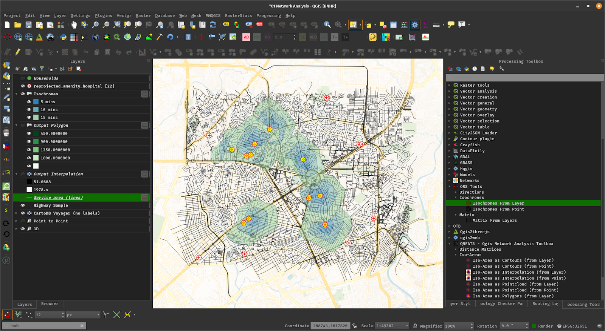

<!--  -->

*Note: This is an in-progress draft. Formatting, especially images, will be improved once feedback on structure and main text is received.*

# About QGIS

[QGIS](https://qgis.org) is a full-featured, user-friendly, free-and-open-source (FOSS) Geographic 
Information System (GIS) that runs on Unix platforms (e.g. Linux), Windows, and MacOS.

## Under the hood

QGIS is developed using the [Qt toolkit](https://qt.io) and C++, since 2002, and has a pleasing, easy-to-use graphical user interface with multilingual support. It is maintained by an active developer team and supported by a vibrant community of GIS professionals, enthusiasts, geospatial data publishers, and end-users. 

## Versions and release cycle

[QGIS development and releases follow a time based schedule/roadmap](https://www.qgis.org/en/site/getinvolved/development/roadmap.html). There are three main branches of QGIS that users can install. These are the **Long Term Release (LTR)** branch, **Latest Release (LR)** branch, and the **Development (Nightly)** branch.

- **Long Term Release (LTR)** is maintained and receives bug fixes until the next LTR is released. Currently, an LTR is released every year.
- **Latest Release (LR)** refers to the release version of QGIS that contains the most recent or latest features. A new LR is released every four (4) months. Currently, every 3rd LR becomes the next LTR.
- **Development/Nightly** is based on the most recent version of the QGIS source code. It is not recommended for production environments but is useful if you want to test, debug, or help in the development of QGIS.

Every month, there is a **Point Release** that provides bug-fixes to the LTR and bug-fixes as well as new features to the LR.

## Free and Open Source

QGIS is released under the GNU Public License (GPL) Version 2 or above. Developing QGIS under this license means that you can (if you want to) inspect and modify the source code and guarantees that you, our happy user, will always have access to a GIS program that is free of cost and can be freely modified.

QGIS is part of the Open-Source Geospatial Foundation ([OSGeo](https://www.osgeo.org/)), offering a range of complementary open-source GIS software projects.

# Features

## Flexible and powerful spatial data management

- Supports raster, vector, mesh, and point cloud data in a range of industry-standard formats
    - *Supported raster formats include:* GeoPackage, GeoTIFF, GRASS, ArcInfo binary and ASCII grids, ERDAS Imagine SDTS, WMS, WCS, PostgreSQL/PostGIS, and [other GDAL supported formats](https://gdal.org/drivers/raster/index.html).
    - *Supported vector formats include:* GeoPackage, ESRI Shapefiles, GRASS, SpatiaLite, PostgreSQL/PostGIS, MSSQL, Oracle, WFS, Vector Tiles and [other OGR supported formats](http://www.gdal.org/ogr_formats.html). 
    - *Supported mesh formats include*: NetCDF, GRIB, 2DM, and [other MDAL supported formats](https://github.com/lutraconsulting/MDAL#supported-formats).
    - *Currently supported point-cloud format*: LAS/LAZ.
- Load and access local files, spatial databases (PostGIS, SpatiaLite, MSSQL, DB2, SAP HANA), web services (WMS, WCS, WFS, ArcGIS REST services), tile services, etc.
- On-the-fly reprojection between coordinate reference systems (CSR)
- Visual and numerical and digitizing and editing
- Temporal support

## Beautiful cartography and map design

- Large variety of rendering options in 2D and 3D
- Style Manager for creating, storing, and managing styles
- 500+ built-in color ramps (cpt-city, ColorBrewer, etc.) 
- Preview modes for inclusive map making (Monochrome, Color Blindness)
- Fine control over symbology, labeling, legends, and additional graphical elements for beautifully-rendered maps
- Advanced styling using Data-defined overrides, Blending modes, and Draw effects
- On-the-fly rendering enhancements using Geometry Generators (e.g. create and style new geometries from existing features)
- Generate multiple maps (and reports) automatically using QGIS Atlas and QGIS Reports
- Flexible output direct to printer, or as image (raster), PDF, or SVG for further customization
- [QGIS Style Hub](https://plugins.qgis.org/styles/) for easy sharing of styles

## Advanced and robust geospatial analysis

- Powerful Processing Framework
- 200+ native processing algorithms
- Access to 1000+ processing algorithms via Processing Providers such as GDAL, SAGA, GRASS, OrfeoToolbox, other processing plugins, as well as custom models and processing scripts
- Graphical modeller
- Batch processing
- Geospatial database engine (filters, joins, relations, forms, etc.) that is as format-independent and datasource-independent as possible
- GIS and Remote Sensing capabilities

## Customizability and extensibility

- Fully customizable user-experience from the user-interface to the application settings that cater to power-users and beginners alike
- Rich [Expression engine](https://docs.qgis.org/testing/en/docs/user_manual/working_with_vector/expression.html) for maximum flexibility in visualization and processing
- Broad and varied [plugin ecosystem](https://plugins.qgis.org/) that includes data connectors, digitizing aids, advanced analysis and charting tools, in-the-field data capture, etc.
- Python and C++ API for standalone (headless) applications as well as in-application comprehensive scripting (PyQGIS)

## QGIS Server

- Headless map server -- running on Linux, macOS, Windows, or in a docker container -- that shares the same code base as QGIS
- Industry-standard protocols (WMS, WFS, WFS3/OGC API for Features and WCS) allow plug-n-play with any software stack
* Works with any web server (Apache, nginx, etc) or standalone
* All QGIS beautiful cartography is supported with best-in-class support for printing
* Fully customizable with Python scripting support

# Screenshots and captures

## Managing Data Sources

Data Source Manager

DB Manager

## Cartography

[Map of Bogota, Columbia in the style of Starry Starry Night by Andrés Felipe Lancheros Sánchez](https://flic.kr/p/2jFfGJP)

[Assen by Harry Bronkworst](https://www.flickr.com/photos/7361002@N08/)

For more maps created with QGIS, visit the [QGIS Map Showcase Flickr Group](https://www.flickr.com/groups/2244553@N22/pool/with/50355460063/).

## Layer Styling

Style Manager

Blending Modes

Data-defined overrides and Draw effects

With Temporal component

## 3D View

3D Map View

DEM + raster overlay

## Point-cloud support

## Graphical Modeller

## Network Analysis

Shortest path from 1 orign to multipule destinations

Travel isochrones

## Interface Customization

## Plugins

## Python console

## QGIS Server

QGIS Server response to a WMS resquest

QGIS Server response to a WFS Feature resquest

# Manuals and Documentation

- [Training Manual](https://docs.qgis.org/latest/en/docs/training_manual/index.html)
- [QGIS User Guide](https://docs.qgis.org/latest/en/docs/user_manual/index.html)
- [QGIS Server Guide](https://docs.qgis.org/latest/en/docs/server_manual/index.html)
- [Documentation Guidelines](https://docs.qgis.org/latest/en/docs/documentation_guidelines/index.html)
- [PyQGIS Cookbook](https://docs.qgis.org/latest/en/docs/pyqgis_developer_cookbook/index.html)
- [Developers Guide](https://docs.qgis.org/latest/en/docs/developers_guide/index.html)
- [Visual Changelog](https://qgis.org/en/site/forusers/visualchangelogs.html)

# Installation and Downloads

Precompiled binaries for QGIS are available at [the QGIS.org download page](https://www.qgis.org/en/site/forusers/download.html). Please follow the installation instructions carefully.

The [building guide](INSTALL.md) can be used to get started with building QGIS from source.

For installation of QGIS Server, see its [getting started documentation](https://docs.qgis.org/latest/en/docs/server_manual/getting_started.html).

# Help and Support Channels

There are several channels where you can find help and support for QGIS:

- Using the QGIS community site at [https://qgis.org](https://qgis.org)
- Joining the [qgis-users mailing list](https://lists.osgeo.org/mailman/listinfo/qgis-user)
- Chatting with other usesrs real-time. *Please wait around for a response to your question as many folks on the channel are doing other things and it may take a while for them to notice your question. The following paths all take you to the same chat room:*
    - Using an IRC client and joining the [#qgis](http://webchat.freenode.net/?channels=#qgis) channel on irc.freenode.net.
    - Using a Matrix client and joining the [#qgis:matrix.org](http://matrix.to/#/#qgis:matrix.org) room.
    - Using [Gitter](https://gitter.im/qgis/QGIS?utm_source=badge&utm_medium=badge&utm_campaign=pr-badge&utm_content=badge) chat.
 - At the [GIS stackexchange](https://gis.stackexchange.com/) or [r/QGIS reddit](https://www.reddit.com/r/QGIS/), which are not maintained by the QGIS team, but where the QGIS and broader GIS community provides lots of advice
- [Other support channels](https://qgis.org/en/site/forusers/support.html)

# Get Involved with the Community

## Bug reporting and bug fixing

You can contribute to the project **by submitting bug reports or fixing bugs** in the [QGIS bug tracker](https://github.com/qgis/QGIS/issues/).

## New features and enhancements

If you wish to contribute patches you can [fork the project](https://help.github.com/forking/), make your changes, commit to your repository, and then [create a pull request](https://help.github.com/articles/creating-a-pull-request-from-a-fork/). The development team can then review your contribution and commit it upstream as appropriate.

If you commit a new feature, add `[FEATURE]` to your commit message AND give a clear description of the new feature. A webhook will automatically create an issue on the QGIS-Documentation repo to tell people to write documentation about it.

For large-scale changes, you can open a [QEP (QGIS Enhancement Proposal)](https://github.com/qgis/QGIS-Enhancement-Proposals). QEPs are used in the process of creating and discussing new enhancements or policy for QGIS. All QEP's are created as new issues and should generally be created for (only examples):

- Large application wide changes (e.g major UI redesign)
- Large work with wider scope (e.g something that might effect how layers are loaded.)
- Community processes and policies (e.g 3.0 release)

Generally smaller features do not require a QEP unless they can have large knock on effect. Bug fixes do not require a QEP.

## Translations

Help translate QGIS to your language. At this moment about forty languages are already available in the Desktop user interface and about eighty languages are available in transifex ready to be translated.

The [translation](https://qgis.org/en/site/getinvolved/translate.html) process is managed by the [Translation Team](https://qgis.org/en/site/getinvolved/governance/governance.html#gui-translation) and all the activities are done under the [Transifex](https://www.transifex.com/) platform.

## Other ways to contribute

If you are not a developer, there are many other possibilities which do not require programming skills to help QGIS to evolve. Check our [project homepage for more information](http://qgis.org/en/site/getinvolved/index.html).